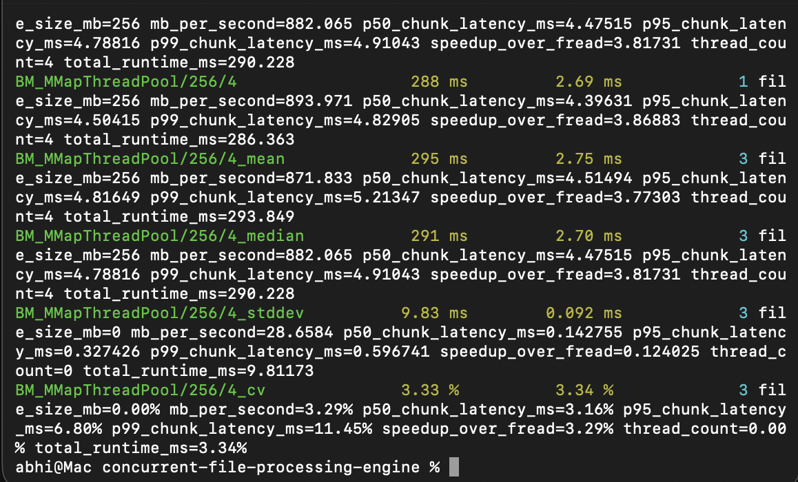
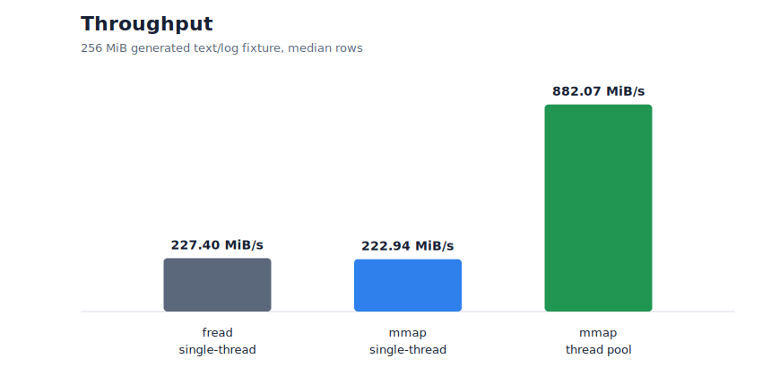
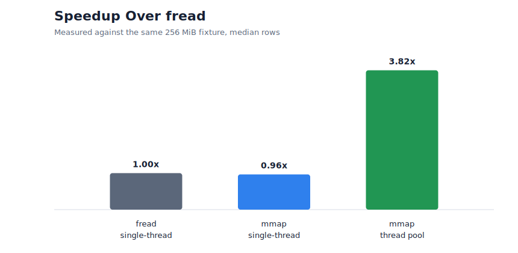
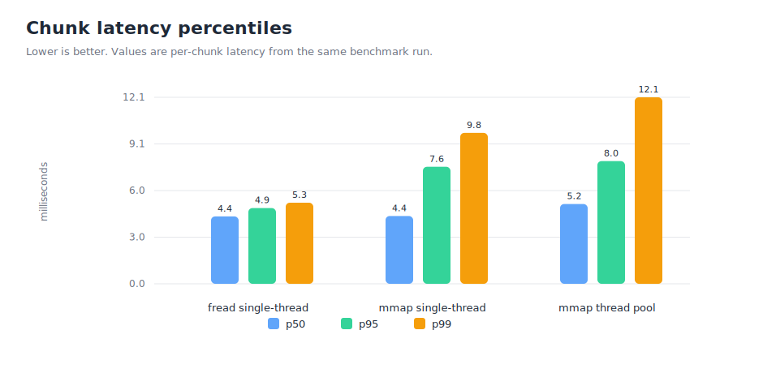

# Concurrent File Processing Engine

Memory-mapped word-frequency analysis for large text and log files.

## Overview

Concurrent File Processing Engine scans regular files from an input directory, tokenizes their contents, counts word frequencies, and writes JSON summaries. It is built around POSIX memory mapping, fixed-size chunking, a custom work-stealing scheduler, per-thread local aggregation, and a final merge step that computes totals and top words.

The project is intentionally small. It focuses on the mechanics of file mapping, chunk boundary correctness, and thread-pool scheduling rather than adding a broad feature set.

## What it does

- Reads configuration from `config.json`.
- Finds regular files in the configured input directory.
- Maps each file with POSIX `mmap`.
- Splits mapped data into fixed-size chunks.
- Processes chunks through a custom work-stealing scheduler.
- Counts alphanumeric tokens case-insensitively.
- Merges per-thread word maps after processing completes.
- Writes one JSON result per file and a combined `benchmark_report.json`.

## Architecture

```text
config.json
    |
    v
Input directory
    |
    v
+------------+     +---------------+     +---------------------+
| FileMapper | --> | ChunkSplitter | --> | ThreadPool          |
| mmap RAII  |     | byte ranges   |     | per-worker deques   |
+------------+     +---------------+     +----------+----------+
                                                    |
                                                    v
                                         +--------------------+
                                         | ChunkProcessor     |
                                         | local word counts  |
                                         +---------+----------+
                                                   |
                                                   v
                                         +--------------------+
                                         | ResultAggregator   |
                                         | merge and top N    |
                                         +---------+----------+
                                                   |
                                                   v
                                         JSON output files
```

The hot path avoids shared writes: each worker builds a local `unordered_map`, and the final merge happens after all chunks have been processed.

## Tech stack

| Area | Technology |
| --- | --- |
| Language | C++17 |
| Build | CMake |
| File I/O | POSIX `mmap`; `fread` benchmark baseline |
| Concurrency | `std::thread`, `std::mutex`, `std::condition_variable`, `std::atomic` |
| Containers | `std::deque`, `std::unordered_map`, `std::vector` |
| JSON | `nlohmann/json` |
| Tests | Google Test |
| Benchmarks | Google Benchmark |
| CI | GitHub Actions |

## Build

```bash
cmake -S . -B build -DCMAKE_BUILD_TYPE=Release
cmake --build build --parallel
```

CMake fetches `nlohmann/json`, Google Test, and Google Benchmark during configuration.

To build only the benchmark executable after configuring:

```bash
cmake --build build --target cfpe_benchmarks --parallel
```

## Run

Place files to process in `input/`, then run:

```bash
./build/concurrent-file-processing-engine config.json
```

The executable prints a short per-file summary and writes JSON output to the configured output directory.

## Configuration

Default `config.json`:

```json
{
  "input_directory": "input",
  "output_directory": "output",
  "thread_count": 4,
  "chunk_size_bytes": 4194304,
  "top_n": 20,
  "mode": "word_frequency",
  "output_format": "json"
}
```

Validation rules:

- `thread_count`, `chunk_size_bytes`, and `top_n` must be positive integers.
- `mode` must be `word_frequency`.
- `output_format` must be `json`.

## Output format

For each input file, the engine writes:

```json
{
  "file": "input/example.log",
  "file_size_mb": 0.000052,
  "thread_count": 4,
  "chunk_size_bytes": 4194304,
  "chunks_processed": 1,
  "total_words": 8,
  "unique_words": 7,
  "processing_time_ms": 0.18,
  "top_words": [
    { "word": "cache", "count": 2 },
    { "word": "2026", "count": 1 }
  ]
}
```

The values above show the schema only. They are not benchmark results.

The engine also writes `benchmark_report.json`, which summarizes all files processed in one run.

## Correctness notes

Tokenization treats letters and digits as part of words, lowercases tokens, and treats punctuation or whitespace as delimiters.

Chunks may split words. To avoid double-counting or dropping those words:

- A chunk that starts in the middle of a word skips the leading fragment.
- A chunk that starts a word may read past its nominal end until that word is complete.
- Later chunks skip the same word fragment because they begin in the middle of it.

This keeps fixed-size chunking simple while preserving word-count correctness across chunk boundaries.

## Design decisions

**Memory mapping:** `FileMapper` owns the file descriptor and mapping lifetime. Empty files are handled without calling `mmap`.

**Work stealing:** each worker owns a mutex-protected deque. When a worker runs out of local chunks, it steals from another queue. The implementation avoids lock-free structures and keeps scheduling logic explicit.

**Local aggregation:** workers update only their own maps while processing. Global aggregation is done after the pool completes, which avoids contention on a shared frequency map.

**JSON output:** results are written with `nlohmann/json` so the output is easy to inspect and script against.

## Testing

Configure and build with tests enabled, then run:

```bash
ctest --test-dir build --output-on-failure
```

The tests cover:

- `mmap` wrapper behavior for empty, non-empty, missing, and non-regular files
- chunk splitting for empty files, exact chunks, multiple chunks, and final partial chunks
- tokenization, lowercase normalization, punctuation handling, repeated words, and numeric tokens
- split-word behavior across chunk boundaries
- result aggregation, total counts, unique counts, top-N ordering, and tie-breaking
- configuration validation

## Benchmarks

The benchmark target compares:

- single-threaded `fread` processing
- single-threaded `mmap` processing
- multi-threaded `mmap` processing with the custom thread pool

Run:

```bash
./build/cfpe_benchmarks
```

To write Google Benchmark output as JSON:

```bash
./build/cfpe_benchmarks --benchmark_out=output/google_benchmark_report.json --benchmark_out_format=json
```

To collect repeated measurements and median rows:

```bash
./build/cfpe_benchmarks --benchmark_min_time=0.05s --benchmark_repetitions=3 --benchmark_report_aggregates_only=false --benchmark_out=output/google_benchmark_report.json --benchmark_out_format=json
```

The benchmark executable reports file size, runtime, throughput, speedup over the measured `fread` baseline, and p50/p95/p99 chunk latency. It creates a deterministic text/log-style fixture under the system temporary directory.

The snapshot below was generated locally from the current code with a 256 MiB fixture, which is about 268 MB. Treat it as a machine-specific measurement, not a portable performance guarantee. The terminal screenshot shows the raw Google Benchmark output for the thread-pool run; the table uses median rows from the same recorded benchmark report.










| Strategy | Dataset | File Size | Threads | Runtime | Throughput | Speedup | p50 Chunk | p95 Chunk | p99 Chunk |
| --- | --- | ---: | ---: | ---: | ---: | ---: | ---: | ---: | ---: |
| `fread` single-threaded | Generated fixture | 256 MiB | 1 | 1125.76 ms | 227.40 MiB/s | 1.00x | 4.20 ms | 4.43 ms | 5.10 ms |
| `mmap` single-threaded | Generated fixture | 256 MiB | 1 | 1148.27 ms | 222.94 MiB/s | 0.96x | 4.21 ms | 4.45 ms | 6.83 ms |
| `mmap` thread pool | Generated fixture | 256 MiB | 4 | 290.23 ms | 882.07 MiB/s | 3.82x | 4.48 ms | 4.79 ms | 4.91 ms |
